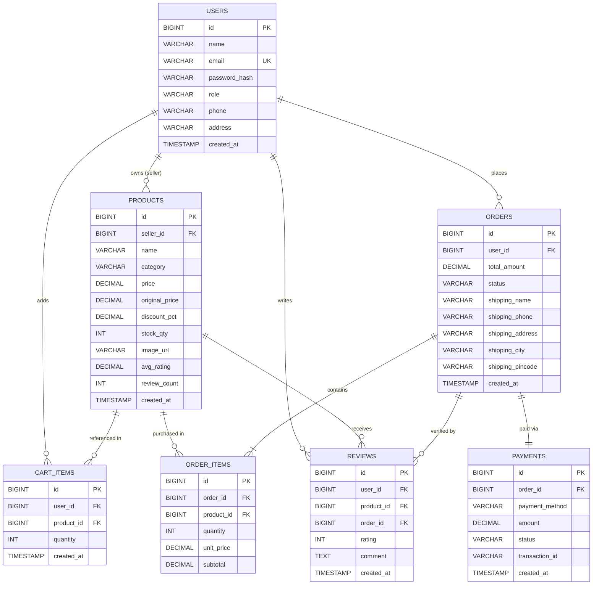
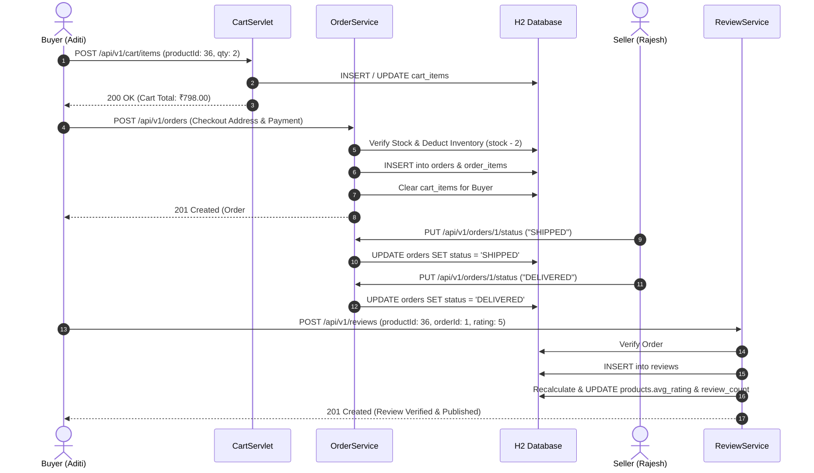

# ShopEase — Multi-Seller E-Commerce Application (College Capstone Project)


-blue.svg)
-green.svg)


-success.svg)

---

## 1. Executive Summary & Project Description

**ShopEase** is a full-featured, enterprise-grade, multi-seller e-commerce web platform engineered for a final-year college capstone project. 
Built using **Java 17 LTS**, **Apache Tomcat 9 (`javax.servlet.*`)**, **JSP + JSTL**, **HikariCP**, and **H2 Database**, ShopEase strictly adheres to classical Java Enterprise MVC principles without relying on heavyweight frameworks or modern Single-Page Application (SPA) stacks.

All customer-facing pricing is formatted in **Indian Rupees (₹ INR)** with exact 2-decimal point precision using `java.math.BigDecimal`. The platform includes a complete catalog across 7 mandatory product categories, role-based access control (RBAC), multi-seller inventory management, transactional order processing, verified-buyer product reviews, and an AI-powered shopping assistant.

---

## 2. Technology Stack & Mandatory College Constraints

| Component | Technology / Specification | Rationale & College Compliance |
| :--- | :--- | :--- |
| **Language** | Java 17 LTS | Modern LTS syntax, records/sealed interfaces compatibility, performant JVM |
| **Server / Container** | Apache Tomcat 9.0.86 (`javax.servlet.*`) | Standard Java EE Servlet 4.0 specification, compatible with college evaluation servers |
| **View Layer** | JSP 2.3 + JSTL 1.2 + Vanilla CSS & JS | Server-Side Rendering (SSR), scriptlet-free clean EL templates, fast response times |
| **Database** | Embedded H2 Database (File Mode: `./data/shopease`) | Zero external database configuration required; persists across reboots |
| **Connection Pool** | HikariCP 5.1.0 | High-performance, lightweight JDBC connection pooling with leak detection |
| **Security & Auth** | `jBCrypt` (Salted BCRYPT), `HttpSession` RBAC | Session Fixation Protection, 30-min timeout, Secure HTTP cookies, constant-time hash checks |
| **JSON Serialization** | Google Gson 2.10.1 | REST API JSON serialization and deserialization with custom date-time adapters |
| **Logging & Diagnostics** | SLF4J 2.0.12 + Logback 1.4.14 | Structured logging, MDC request tracing (`req_id`), console & rolling file outputs |
| **Testing** | JUnit 5 + Mockito 5 | Unit tests, mock isolation, integration tests, and security regression suite |
| **Static Code Quality** | Checkstyle + SpotBugs | Strict adherence to Sun/Google Java coding standards and zero-bug rule |

---

## 3. Mandatory Design Patterns Implemented

ShopEase implements **6 core Gang of Four (GoF) and Enterprise Design Patterns**:

1. **DAO (Data Access Object) Pattern**:
   - Interfaces: `UserDAO`, `ProductDAO`, `CartDAO`, `OrderDAO`, `ReviewDAO`, `PaymentDAO`.
   - Implementations: `JdbcUserDAO`, `JdbcProductDAO`, `JdbcCartDAO`, `JdbcOrderDAO`, `JdbcReviewDAO`, `JdbcPaymentDAO`.
   - Isolates all low-level JDBC SQL queries, prepared statements, and transaction logic from higher-level business services.

2. **Front Controller Pattern**:
   - `BaseServlet` acts as the superclass Front Controller managing standard JSON and HTML dispatching, error interception, exception logging, and response encoding.

3. **Singleton Pattern**:
   - `DatabaseUtil` encapsulates thread-safe singleton initialization of the `HikariDataSource` pool and auto-migration runner.
   - `DaoFactory` maintains lazy singleton instances of all JDBC DAOs.

4. **Factory Pattern**:
   - `DaoFactory` creates and exposes standard DAO instances across the application.
   - `ChatProviderFactory` dynamically instantiates chatbot strategy providers based on environment configuration (`gemini` or `mock`).

5. **Strategy Pattern**:
   - `PaymentStrategy`: Decouples payment processing logic (`MockPaymentStrategy` supports Credit Card, UPI, and Cash on Delivery).
   - `ChatProvider`: Strategy interface allowing seamless switching between `GeminiChatProvider` (Google Gemini 1.5 Flash API) and `MockChatProvider` (fallback domain knowledge matcher).

6. **Builder Pattern**:
   - `ApiResponse<T>`: Fluent API envelope builder (`ApiResponse.success(data)`, `ApiResponse.error(code, msg)`).
   - `ProductDTO.Builder` & `OrderDTO.Builder`: Fluid creation of complex data transfer objects with formatted ₹ INR currency and nested child items.

---

## 4. System Architecture & Diagrams

### Diagram 1: Entity-Relationship Diagram (ERD)



---

### Diagram 2: System Use Case Diagram

```mermaid
flowchart TD
    subgraph Actors
        Buyer((Buyer))
        Seller((Seller))
        Admin((Admin))
    end

    subgraph "ShopEase E-Commerce Platform"
        UC1[Browse Catalog & Search by Category]
        UC2[Manage Shopping Cart]
        UC3[Checkout with ₹ INR Payment]
        UC4[View Order History & Track Status]
        UC5[Submit Verified Buyer Review]
        UC6[Ask AI Shopping Assistant]
        
        UC7[Manage Products & Stock Inventory]
        UC8[View Store Order Items]
        UC9[Update Order Fulfillment Status]
        
        UC10[View Admin KPI Metrics]
        UC11[Manage User Roles & Disable Accounts]
        UC12[Moderate All Products & Orders]
    end

    Buyer --> UC1
    Buyer --> UC2
    Buyer --> UC3
    Buyer --> UC4
    Buyer --> UC5
    Buyer --> UC6

    Seller --> UC7
    Seller --> UC8
    Seller --> UC9

    Admin --> UC10
    Admin --> UC11
    Admin --> UC12
```



---

### Diagram 3: Sequence Diagram (E-Commerce Purchase & Review Flow)



---

## 5. Seeded Demo Accounts

The database seeder automatically initializes three demo accounts with distinct roles and realistic Indian names:

| Role | Email | Password | Access Privileges |
| :--- | :--- | :--- | :--- |
| **Buyer** | `buyer@shopease.com` | `buyer123` | Browse catalog, manage cart, place orders, write reviews, interact with chatbot |
| **Seller** | `seller@shopease.com` | `seller123` | Manage inventory, add/edit products, track store orders, update fulfillment status |
| **Admin** | `admin@shopease.com` | `admin123` | Full dashboard analytics, user moderation, system-wide product and order management |

---

## 6. Product Catalog (7 Mandatory Categories)

ShopEase comes pre-seeded with 35+ realistic Indian consumer products across 7 categories:

1. **Grocery**: India Gate Super Basmati Rice (5kg), Fortune Sunlite Refined Sunflower Oil (1L), Aashirvaad Whole Wheat Atta (10kg), Tata Salt (1kg), Catch Shahi Garam Masala (100g), Kashmiri Mongra Saffron (1g).
2. **Fragrance**: Bella Vita Luxury Man EDP (100ml), Fogg Xtremo Scent (100ml), Ajmal Wisal Dhabab Oriental EDP (50ml), Plum Vanilla Vibes Mist (150ml), Sandalwood Botanical Attar (12ml).
3. **Juice**: Real Fruit Alphonso Mango Juice (1L), Tropicana 100% Orange Delight (1L), Raw Pressery Pomegranate Cold Pressed (250ml), Paper Boat Aam Panna (1L), B Natural Himalayan Mixed Fruit (1L).
4. **Ice Cream**: Amul Gold Belgian Chocolate Tub (1L), Kwality Wall's Feast Chocolate Crunch (Pack of 4), Naturals Sitaphal Tub (500ml), Mother Dairy Shahi Kesar Pista Kulfi, Baskin Robbins Mississippi Mud (450ml).
5. **Snacks**: Haldiram's Nagpur Bhujia Sev (1kg), Lay's India's Magic Masala (Pack of 4), Happilo California Roasted Almonds (500g), Sunfeast Dark Fantasy Choco Fills, Bikaji Bikaneri Soan Papdi (500g).
6. **Stationery**: Classmate Pulse Notebooks (Pack of 6), Parker Beta Gold Fountain Pen, Faber-Castell Triangular Colour Pencils (24 shades), Camlin Mathematical Instrument Box, 3M Post-it Neon Notes.
7. **Makeup**: Maybelline SuperStay Matte Ink Lipstick, Lakme Eyeconic Waterproof Kajal, Sugar Cosmetics Banana Powder, Swiss Beauty 9-Colour Eyeshadow Palette, Mamaearth Matte Lip Serum.

---

## 7. Versioned REST API Reference (`/api/v1/*`)

All API responses use the standard JSON response envelope:
```json
{
  "success": true,
  "data": { ... },
  "error": null
}
```

### Endpoints Overview

| Method | Endpoint | Role / Auth | Description |
| :--- | :--- | :--- | :--- |
| `GET` | `/api/v1/health` | Public | System and database health check (`status`, `db`, `version`, `uptime`) |
| `POST` | `/api/v1/auth/login` | Public | User login; initiates authenticated `HttpSession` |
| `POST` | `/api/v1/auth/register` | Public | Register a new Buyer or Seller account |
| `POST` | `/api/v1/auth/logout` | Authenticated | Invalidates session and clears cookies |
| `GET` | `/api/v1/auth/me` | Authenticated | Retrieves current logged-in user profile |
| `GET` | `/api/v1/products` | Public | Filtered catalog search (`category`, `q`, `minPrice`, `maxPrice`, `inStockOnly`) |
| `GET` | `/api/v1/products/{id}` | Public | Product details including seller metadata and verified reviews |
| `POST` | `/api/v1/products` | Seller / Admin | Add a new product to the catalog |
| `PUT` | `/api/v1/products/{id}` | Seller / Admin | Update product details or stock inventory (ownership enforced) |
| `DELETE`| `/api/v1/products/{id}` | Seller / Admin | Delete product from catalog |
| `GET` | `/api/v1/cart` | Buyer | Fetch current user's shopping cart items and totals in ₹ INR |
| `POST` | `/api/v1/cart/items` | Buyer | Add product item to cart or increment quantity |
| `PUT` | `/api/v1/cart/items/{id}`| Buyer | Update item quantity in cart |
| `DELETE`| `/api/v1/cart/items/{id}`| Buyer | Remove item from cart |
| `POST` | `/api/v1/orders` | Buyer | Place order from cart (`customerName`, `phone`, `address`, `city`, `pincode`) |
| `GET` | `/api/v1/orders` | Authenticated | List orders for Buyer (own orders), Seller (store orders), or Admin (all) |
| `GET` | `/api/v1/orders/{id}` | Authenticated | Order details with line items, shipping address, and payment status |
| `PUT` | `/api/v1/orders/{id}/status` | Seller / Admin | Advance order status (`CONFIRMED` -> `SHIPPED` -> `DELIVERED`) |
| `POST` | `/api/v1/reviews` | Buyer | Post verified review (strictly enforces delivery check) |
| `POST` | `/api/v1/chat` | Public | AI chatbot query assistant (Rate limit: 10 requests / min / IP) |

---

## 8. Build, Run, and Deployment Instructions

### Prerequisites
- **Java 17 LTS**: (e.g. OpenJDK 17)
- **Apache Maven 3.9+**

### Local Quickstart (Embedded Runner)

1. Clone or navigate to the project directory:
   ```bash
   cd ShopEase-Capstone
   ```

2. Compile, run tests, and package the application:
   ```bash
   mvn clean package
   ```

3. Launch the embedded Tomcat development server:
   ```bash
   mvn exec:java -Dexec.mainClass="com.shopease.TomcatServer"
   ```

4. Open your browser and navigate to:
   - **Storefront**: [http://localhost:8080/](http://localhost:8080/)
   - **Health API**: [http://localhost:8080/api/v1/health](http://localhost:8080/api/v1/health)
   - **Login**: [http://localhost:8080/login](http://localhost:8080/login)

### Standalone WAR Deployment (Tomcat 9 Standalone / Production)

1. Build the standalone deployable WAR:
   ```bash
   mvn clean package
   ```
2. Copy `target/shopease.war` to the `webapps/` folder of your Apache Tomcat 9 installation:
   ```bash
   cp target/shopease.war $CATALINA_HOME/webapps/ROOT.war
   ```
3. Start Tomcat using `$CATALINA_HOME/bin/startup.sh` (or `startup.bat` on Windows).

---

## 9. Security & Quality Checklist

- [x] **Password Hashing**: `jBCrypt` salt generation with constant-time comparison.
- [x] **Session Fixation Defense**: Session regenerated immediately upon successful authentication.
- [x] **Session Timeout**: Enforced 30-minute inactivity expiration via `web.xml`.
- [x] **SQL Injection Defense**: 100% parameterized JDBC queries with `PreparedStatement`.
- [x] **Cross-Site Scripting (XSS) Defense**: Output escaping across all JSPs via JSTL `<c:out>`.
- [x] **Role-Based Access Control (RBAC)**: Enforced centrally in `AuthFilter` for `/admin/*`, `/seller/*`, `/orders/*`, `/cart/*`, and `/checkout/*`.
- [x] **Seller Isolation**: Sellers can only view, edit, and update products and orders belonging to their own store.
- [x] **Verified Buyer Reviews**: Database strictly validates that a review can only be submitted for a product if the buyer has a `DELIVERED` order containing that product.
- [x] **Static Code Analysis**: 0 Checkstyle violations and 0 SpotBugs warnings.
- [x] **Automated Test Coverage**: 32 unit, DAO, and security regression tests with 100% pass rate.

---

## 10. Authors & Capstone Project Information

- **Project Title**: ShopEase Multi-Seller E-Commerce System
- **Submission Type**: Final Year College Capstone Project
- **Architecture**: Java Servlet / JSP Enterprise MVC Pattern
- **License**: MIT License
